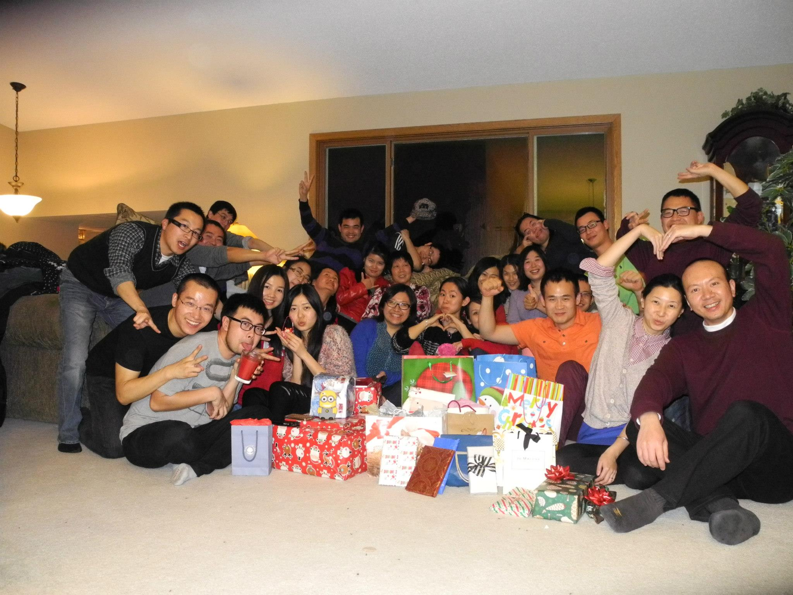



<head>
    <link href="themes/2/js-image-slider.css" rel="stylesheet" type="text/css" />
    
</head>

  

    
    <a class="lazyImage" href="images/image-slider-2.jpg" title="Pure Javascript. No jQuery. No Flash.">Pure JavaScript</a>
    <a href="http://www.menucool.com/javascript-image-slider"><b data-src="images/image-slider-3.jpg">Image Slider</b></a>
    <a class="lazyImage" href="images/image-slider-4.jpg" title="">Slide 4</a>
  

  <!--thumbnails-->
  

    

      

      

HTML Content
Thumbnails allows any HTML content

      

    

    

      

      

Customizable
Thumbnail style is customizable

      

    

    

      

      

Variety of Layouts
Just a CSS tweak.

      

    

    

      

      

Integration
Built-in functions for the thumbnails

      

    

  

  <!--clear above float:left elements. It is required if above #slider is styled as float:left. -->
  

   

###Latest Posts

<ul class="posts">
  
  <li>{{ post.date | date_to_string }} &raquo; <a href="{{ BASE_PATH }}{{ post.url }}">{{ post.title }}</a>
   - {{ post.author }}</li>
  
</ul>
