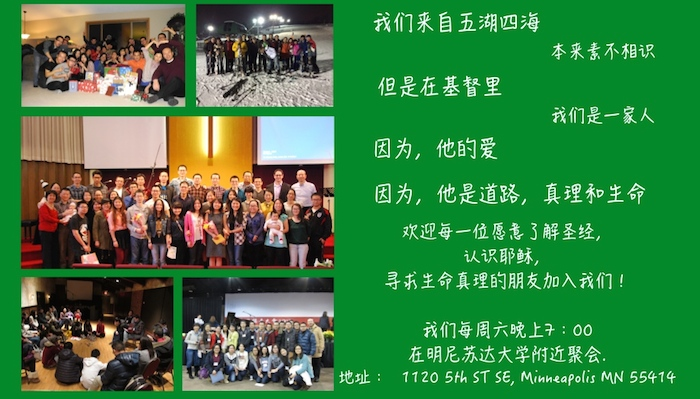



<head>
    <link href="themes/2/js-image-slider.css" rel="stylesheet" type="text/css" />
    
</head>

  

    
    <a class="lazyImage" href="images/slider-2-bible-study.jpg" title="">Bible Study</a>
    
    <a class="lazyImage" href="images/weekly-verse.jpg" title="">Slide 4</a>
    <a class="lazyImage" href="images/prayer.jpg" title="">Slide 5</a>
  

  

    Join our Weekly Bible Study @<a href="https://www.google.com/maps/place/1120+5th+St+SE,+Minneapolis,+MN+55414/@44.9824569,-93.238446,17z/dat\
  a=!3m1!4b1!4m2!3m1!1s0x52b32d0d867d49b7:0xfb1c35546f49c8f6?hl=en">CRU House</a>. Need a ride? Feel free to email to nlf.campus@gmail.com or contact Yang Shuo @ 952-297-6289
  

  

    请点击<a href="http://www.tcccc.org/zh-hant/sermon_mand">这里</a>聆听马牧师的讲道
  

  <!--thumbnails-->
  

    

      

      

关于我们
我们是由明尼苏达双城地区的中国基督徒学生学者组成的校园团契

      

    

    

      

      

每周查经
欢迎和我们一起来学习神的话，了解这位创造宇宙万物的真神

      

    

    

      

      

轻轻听......
双城华人基督教会国语部马天岚牧师的讲道

      

    

    

      

      

每周经文
在神的话语里我们与主同行

      

    

	

	  

      

请聆听我们为你的祷告
先别走开......

      

    

	
  

  <!--clear above float:left elements. It is required if above #slider is styled as float:left. -->
  

   

<ul class="posts">
  
  <li>{{ post.date | date_to_string }} &raquo; <a href="{{ BASE_PATH }}{{ post.url }}">{{ post.title }}</a>
   - {{ post.author }}</li>
  
</ul>

<iframe src="//www.facebook.com/plugins/like.php?href=http%3A%2F%2Fnlfcampus.github.io%2F&amp;width&amp;layout=button_count&amp;action=like&amp;show_faces=true&amp;share=true&amp;height=21&amp;appId=286591694835592" scrolling="no" frameborder="0" style="border:none; overflow:hidden; height:21px;" allowTransparency="true"></iframe>
